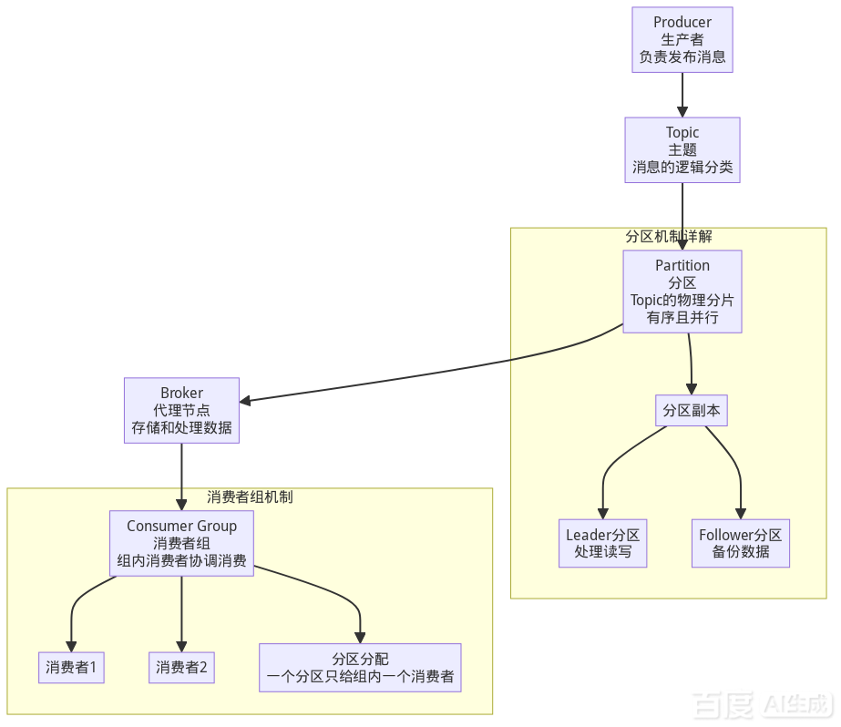

# 基础
### 什么是 Kafka
Kafka 是由 LinkedIn 开源、Apache 基金会维护的‌分布式事件流平台‌，它早已超出传统消息队列（MQ）的范畴，核心定位是高吞吐的事件流存储与处理系统，可实现海量数据的实时传输、持久化与多下游并行消费。
1. Kafka 为什么这么快
‌极致磁盘利用‌：采用顺序追加写盘，完全规避随机写的磁头寻道开销，顺序读写速度接近内存性能；同时依托操作系统 PageCache 缓存数据，避开 JVM 堆内存的垃圾回收开销。
‌高效数据传输‌：通过零拷贝技术（sendfile 系统调用），让数据直接从磁盘经内核态传输到网卡，减少2次上下文切换和多余内存拷贝；同时支持批量压缩发送，大幅降低网络IO次数。
‌并行消费优化‌：Topic 拆分为多个分区分布在不同 Broker，消费者采用拉模式批量拉取消息（默认上限500条），充分发挥分布式集群的横向扩展能力。
2. Kafka 为什么适合大数据
‌超高吞吐能力‌：单机吞吐量可达百万级消息/秒，可轻松承载日志、全量业务数据等海量数据的持续写入，适配大数据场景下的高流量特征。
‌持久化存储特性‌：消息按时间/大小规则长期保留（默认7天），消费完不会立即删除，支持下游多个大数据组件（Spark、Flink、HDFS、数仓）独立回溯消费，互不干扰。
‌生态高度兼容‌：是大数据生态的标准数据管道组件，可无缝对接各类大数据处理框架，实现业务Binlog、用户行为日志等数据的统一采集与流转。
3. Kafka 为什么适合高并发
‌异步批量机制‌：生产者发送消息是异步非阻塞模式，消息先写入本地内存后立即返回，再由专属IO线程批量聚合发往Broker，大幅降低高并发下的网络IO压力。
‌分区水平扩展‌：通过分区机制将并发能力分散到多台Broker，可通过增加节点线性提升集群整体并发承载量，轻松支撑十万级以上的生产消费并发连接。
‌低锁高并发设计‌：核心流程基于顺序写、页缓存等无锁化设计，避免了传统MQ中复杂路由逻辑带来的锁竞争开销，高并发场景下系统稳定性极强。
4. Kafka 与传统消息队列MQ的核心区别
传统MQ（如RabbitMQ）核心定位是业务系统间的异步通信与解耦，侧重复杂路由、消息即时消费后删除；而Kafka本质是分布式事件流平台，核心优势是高吞吐、海量数据持久化、多下游并行消费，更适配大数据与高并发事件流场景，而非单纯的业务消息中转。

### Kafka 能解决什么问题
1. 日志统一收集与传输问题
‌解决痛点‌：大型分布式系统中数十上百个微服务的日志分散存储，运维排查混乱，突发流量直接冲垮下游日志分析系统。
‌落地流程‌：所有应用/服务器的操作日志、运行指标批量异步发送到Kafka集群，Kafka作为中央缓冲区解耦上下游，下游对接ELK栈（Elasticsearch、Logstash、Kibana）做实时日志检索与监控，也可对接Hadoop做离线日志分析，全程几乎不占用业务应用的性能资源。
2. 业务系统解耦与异步处理问题
‌解决痛点‌：传统下单流程中，订单系统需要同步调用库存、物流、积分、短信等多个下游服务，任意一个服务故障都会直接导致下单失败，系统耦合度极高。
‌落地流程‌：订单系统完成核心下单逻辑后，仅将下单消息写入Kafka就直接返回用户下单成功，库存、物流、积分、短信等服务各自订阅Kafka里的下单主题独立消费处理，互不干扰，既实现了系统完全解耦，也通过异步处理大幅缩短了用户的接口响应时间。
3. 高并发流量削峰问题
‌解决痛点‌：电商秒杀、大促活动时短时间内涌入远超系统承载上限的请求，直接压垮后端业务服务，导致系统整体不可用。
‌落地流程‌：用户的秒杀请求先全部写入Kafka队列，系统可根据自身处理能力从队列中匀速拉取请求进行后续业务处理，超出队列上限的请求可直接引导用户排队，避免突发高流量直接冲垮后端服务，保障核心业务的稳定性。
4. 用户行为实时跟踪问题
‌解决痛点‌：网页、APP端的用户浏览、点击、搜索等海量行为数据，传统同步上报方式会占用业务接口资源，且无法同时支撑实时监控和离线分析两类需求。
‌落地流程‌：所有用户行为数据异步发布到Kafka的对应主题，下游订阅者可实时做用户行为分析、推荐系统特征计算，也可将数据同步到数据仓库做长期离线挖掘，全程不影响前端业务的正常运行。
5. 实时流计算数据供给问题
‌解决痛点‌：实时AI风控、工业设备故障预警等场景，需要毫秒级处理海量流式数据，传统数据传输通道延迟高、吞吐不足，无法支撑实时决策。
‌落地流程‌：Kafka作为高吞吐低延迟的数据输送管道，源源不断将交易数据、工业传感器数据喂给Flink、Spark Streaming等流处理框架和AI模型，支撑银行实时反欺诈、设备预测性维护等低延迟场景，保障毫秒级的实时决策能力。
6. 数据库CDC数据同步问题
‌解决痛点‌：传统跨系统数据库同步、缓存更新、搜索索引构建的方式耦合度高，数据一致性难保障，全量同步效率极低。
‌落地流程‌：通过CDC工具捕获数据库的增删改变更记录，将全量+增量的变更数据写入Kafka，下游系统订阅变更消息，自动完成搜索索引更新、缓存刷新、异构数据库同步等操作，实现低侵入、高可靠的流式数据同步。
7. 企业级消息总线/事件驱动架构搭建问题
‌解决痛点‌：企业内数十个业务系统之间点对点通信，接口对接复杂、链路混乱，新业务接入成本极高。
‌落地流程‌：以Kafka为核心搭建统一的事件消息总线，所有业务事件都发布到Kafka集群，各业务系统按需订阅对应事件，无需点对点对接，大幅降低跨系统通信的复杂度，支撑企业级事件驱动架构的落地。

### MQ为什么存在
MQ的诞生本质是为了解决传统同步调用模式的核心痛点，从异步、解耦、削峰三个维度彻底优化分布式系统的架构能力
1. 解决同步调用的高耦合问题
传统A→B→C→D的链式同步调用中，A强依赖B、C、D所有下游服务，任意一个下游服务故障，都会直接导致A的请求失败。
引入MQ后，A只需把消息写入MQ即可返回，完全不需要感知B、C、D的存在和运行状态，下游新增/移除服务也完全不用修改A的代码，从根本上切断了系统间的强依赖，实现了完全解耦。
2. 解决同步调用的低吞吐问题
同步模式下A必须等待B、C、D全部处理完成才能返回，总耗时是所有下游服务的耗时之和，系统吞吐量被串行处理的速度严重限制。
引入MQ后，A的核心逻辑执行完就可以快速返回，下游B、C、D并行从MQ拉取消息独立处理，大幅缩短接口总耗时，单节点可承载的请求数大幅提升，直接拉高系统整体吞吐。
3. 解决突发流量的峰值冲击问题
同步模式下大促、秒杀等场景的突发高流量会直接打向业务服务和数据库，超出系统承载上限就会直接宕机。
引入MQ后，所有突发请求先暂存在MQ队列中，下游业务服务可以根据自身的处理能力匀速拉取消息消费，把瞬时的流量尖峰“削平”成平缓的处理曲线，避免下游系统被突发流量打垮，保障系统整体稳定性。

# kafka 架构

### 双11大白话流程
双11凌晨，你点击下单 ➜ Producer（前端）把订单塞进 Topic（订单主题） ➜ 订单通过哈希算法被分流到 Partition 05（5号流水线） ➜ 该流水线物理存储在 Broker 03（3号服务器）的硬盘上 ➜ 后端由 10 台机器组成的Consumer Group（库存小队）中的某一台 Consumer 赶来，从 5 号流水线把你的订单抓走，完成了扣减库存的操作。

### Broker 服务器节点
1. Broker 是什么
Broker 是 Kafka 集群中的独立服务节点，本质是运行 Kafka 服务的进程，通常部署在物理机或虚拟机上，每个 Broker 拥有全局唯一的 Broker ID 作为身份标识，是 Kafka 实现分布式能力的核心载体。单个 Broker 可以独立运行，生产环境中通常由多个 Broker 组成集群，支撑百万级消息吞吐和海量数据存储。
2. Broker 核心职责
‌接收并处理请求‌：接收生产者发送的消息，响应消费者的拉取请求，完成消息的写入和返回，单节点可轻松处理数千个分区，支撑每秒百万级的消息量。
‌副本管理‌：维护分区的 Leader 和 Follower 副本角色，Leader 副本对外承接该分区的所有读写请求，Follower 副本异步从 Leader 同步数据做冗余备份。
‌集群协同‌：节点间互相通信，配合完成分区分配、故障感知、元数据同步等集群运维工作。
‌监控与运维支撑‌：对外暴露 JMX 等监控接口，上报分区同步状态、磁盘使用率、消息处理速率等核心运行指标，支撑集群运维排查。
3. Broker 保存的核心内容
‌分区物理数据‌：每个 Broker 会存储分配给它的分区数据，每个分区对应独立的物理目录，目录下拆分多个 Segment 文件：
.log 文件：存储实际的消息数据
.index 稀疏索引文件：记录消息偏移量和物理位置的映射，降低索引存储成本
.timeindex 时间戳索引文件：支持按时间范围快速定位消息
‌集群元数据‌：缓存 Topic 分区分布、副本状态、消费者消费偏移量等集群核心元数据，保障节点间数据路由的一致性。
‌消息生命周期管理‌：按照配置的保留策略自动管理数据，默认保留7天，超过时间或磁盘容量阈值后自动清理旧消息；针对变更日志类场景还支持日志压缩，仅保留同一个 Key 的最新版本消息，大幅减少存储空间占用。
4. Broker 如何组成 Cluster
‌节点注册发现‌：所有 Broker 启动后，会自动向协调组件（早期版本依赖 ZooKeeper，新版本 KRaft 模式下通过 Raft 协议自协调）注册自身信息，完成集群内节点的互相感知。
‌分区均衡分布‌：集群启动后，控制器节点会按照“蛇形走位”规则，将所有 Topic 的分区副本均匀分配到不同 Broker 上，确保同一个分区的多个副本不会落在同一台 Broker 中，避免单点故障导致数据丢失，同时实现集群负载均衡。
‌集群状态同步‌：所有 Broker 实时同步集群元数据，感知节点上下线、分区角色变更等事件，对外提供统一的集群服务入口，客户端只需连接任意一个 Broker 就能获取全集群的路由信息。
5. Broker 选举机制
Kafka 的选举分为两个核心层级，分别保障集群管理和分区服务的高可用：
‌Controller 节点选举‌：
所有活跃 Broker 会竞争创建协调组件中的专属临时节点，成功创建该节点的 Broker 就成为集群唯一的 Controller，负责全集群的分区分配、故障检测、元数据广播等核心管理工作。如果 Controller 宕机，临时节点自动消失，其余 Broker 会立刻重新竞争，选出新的 Controller 接管集群管理职责。
‌分区 Leader 副本选举‌：
当某个分区的原 Leader 副本所在 Broker 宕机时，Controller 会从该分区的 ISR（已完成数据同步的副本集合）中，选出一个新的副本作为新的 Leader，继续对外提供读写服务，保障分区服务不中断。如果 ISR 中没有可用副本，才会从剩余的非同步副本中选举 Leader，尽可能兼顾数据一致性和服务可用性。

### Topic 主题
1. 为什么说 Kafka 的 Topic 不是传统队列
传统队列是严格遵循先进先出的线性数据结构，消息被一个消费者取出后就会被直接删除，同一条消息无法被多个不同的业务系统重复消费，且单机存储的队列天然存在性能上限，无法水平扩展。
而 Kafka 的 Topic 只是一个逻辑上的消息分类单元，本身不存储任何实际数据，所有消息都分散存储在它下属的多个 Partition 中，完全打破了传统队列的单机性能瓶颈，同时支持多组消费者独立重复消费同一份消息数据，和传统队列的设计逻辑有本质区别。
2. Topic 类比数据库 Table 的核心逻辑
你提到的类比非常精准，Topic 和数据库的 Table 定位几乎完全一致：
‌业务边界清晰‌：就像数据库里的 order、user、payment 表用来分类存储不同业务的数据，Kafka 里的 order、user、payment、log Topic 也是用来分类承载不同业务的事件流，生产者只会往对应业务的 Topic 里写数据，消费者也只会订阅自己需要的业务 Topic，不会出现数据混杂的情况。
‌元数据统一管理‌：和数据库表会统一记录字段、索引、存储规则一样，Topic 也会统一管理下属所有 Partition 的副本数、消息保留时间、压缩策略等全局配置，所有分片都遵循同一套规则运行。
‌解耦读写双方‌：数据库的表作为中间载体，让写数据的业务服务和读数据的分析服务完全解耦；Topic 同样作为事件流的中间载体，让生产者和消费者完全不需要感知对方的存在，只需要和 Topic 交互即可完成数据流转。
3. Topic 与 Partition 的核心关联
Topic 本身是纯逻辑的分类壳子，它的所有能力都由下属的 Partition 提供：
每个 Partition 是一个独立的、有序的追加写日志文件，分散部署在不同的 Broker 节点上，通过多副本机制实现数据冗余容灾。
分区数直接决定了 Topic 的并行处理上限：消费者组内最多可以有和分区数等量的消费者实例，每个分区只会被组内的一个消费者消费，以此实现超高的并行消费吞吐。
跨分区的消息不保证全局有序，只有同一个 Partition 内的消息会严格按照写入顺序分配递增的 Offset，保障局部顺序性，这也是 Kafka 能支撑百万级吞吐的核心设计基础。

### Partition
Partition 是 Kafka 实现高吞吐分布式能力的最小并行单元，完全支撑了 Kafka 百万级消息处理的核心特性
1. Kafka 为什么要设计 Partition
Topic 只是纯逻辑的消息分类壳子，没有任何实际存储能力，Partition 就是 Topic 的物理数据载体，核心解决三个底层痛点：
‌突破单机存储上限‌：单台 Broker 的磁盘容量、IO 能力是有天花板的，把 Topic 拆成多个 Partition 分散到不同 Broker 上，整个 Topic 的存储容量和处理能力可以随集群节点数水平扩展，理论上没有上限。
‌实现并行读写能力‌：生产者可以并发向多个 Partition 写入消息，消费者也可以并行从多个 Partition 拉取消息，彻底打破单节点的性能瓶颈。
‌保障数据高可用‌：每个 Partition 可以配置多个副本，分散部署在不同 Broker 上，单节点宕机时其他副本可以立刻接管服务，不会出现数据丢失或服务中断。
2. 为什么 Partition 能大幅提升吞吐
这是 Kafka 高吞吐特性的核心底层逻辑，核心来自三层并行优化：
‌跨节点并行处理‌：多个 Partition 分布在不同 Broker 上，集群所有节点的磁盘 IO、网络带宽可以同时被利用，不会出现单节点性能瓶颈。
‌单 Partition 顺序写优化‌：每个 Partition 是独立的追加写日志文件，消息只会往文件末尾顺序追加，磁盘顺序读写的性能几乎和内存相当，完全规避了随机写的高开销。
‌全链路并行协同‌：生产者可以按轮询/哈希策略把消息均匀分发到不同 Partition，实现写入侧负载均衡；消费者组内的不同消费者实例可以同时消费不同 Partition 的数据，消费侧也能完全并行，两者叠加就能支撑每秒百万级的消息吞吐。
3. 为什么 Consumer 数量受 Partition 限制
这是 Kafka 为了避免消费冲突设计的核心分配规则：
在同一个消费者组（Consumer Group）中，‌一个 Partition 最多只会分配给组内的一个消费者实例消费‌，绝对不会出现多个消费者争抢同一个 Partition 的情况，避免重复消费、消息顺序被打乱的问题。
因此消费者组内的并发消费上限，完全由该 Topic 的 Partition 总数决定：如果消费者数量超过 Partition 数量，多出来的消费者会处于空闲状态，完全无法处理任何消息，反而会浪费系统资源。
举个例子：你创建的 Topic 有 P0/P1/P2/P3 共4个分区，那么对应的消费者组最多可以配置4个消费者实例，每个实例负责一个分区，达到最大并行消费能力。
4. 为什么不能无限增加 Partition
分区数不是越多越好，超过合理阈值后反而会严重拖垮集群性能，核心有几个不可忽视的弊端：
‌内存开销指数上升‌：生产者会为每个 Partition 单独维护发送缓存，消费者也会为每个分区维护拉取缓存和消费线程，Broker 端的 Controller、副本同步组件也会维护大量分区级别的内存缓存，分区过多会大幅占用客户端和服务端内存，甚至引发频繁 GC。
‌文件句柄资源耗尽‌：每个 Partition 对应独立的磁盘目录，每个目录下的 Segment 会生成一个数据文件和一个索引文件，每个文件都需要占用操作系统的文件句柄，分区过多很容易超过 Linux 默认的文件句柄上限，导致服务无法正常写入。
‌端到端延迟大幅升高‌：Broker 节点默认只会用一个线程同步所有副本的分区数据，分区过多会导致副本同步排队，消息从写入到同步完成的等待时间变长，生产者发送消息的 ack 响应延迟、消费者拿到消息的端到端延迟都会显著增加。
‌集群高可用性下降‌：单 Broker 宕机时，上面所有 Leader 分区都需要重新选举新 Leader，分区数越多，需要重新选举的分区数量就越多，故障恢复的耗时就越长，集群在故障期间不可用的分区占比就越高。
生产环境的通用经验是：单个 Broker 上的 Leader 分区数最好控制在100以内，整个集群的总分区数不超过 100 * Broker节点数 * 副本数，在性能和稳定性之间找到最优平衡。

### Offset
Offset（偏移量）是Kafka实现消费进度管控的核心设计，它替代了传统消息中间件的ACK确认机制，通过记录分区内消息的唯一序号，让消费者自主维护消费位置，实现了高吞吐下的可靠消费。
1. Offset 如何提交
Kafka提供了两类成熟的提交机制，适配不同业务场景的可靠性和性能需求：
自动提交（默认开启）‌
只需将enable.auto.commit配置设为true，Kafka会根据你设置的auto.commit.interval.ms时间间隔，自动把当前消费者拉取到的最新Offset提交到服务端。它并非通过后台定时任务触发，而是在poll()拉取消息、消费者重平衡、关闭客户端等特定事件发生时，检测距离上次提交的时间是否超过阈值，满足条件就自动执行提交，既节省后台线程资源，也能适配生产者消息速率波动的场景。
‌手动提交‌
把enable.auto.commit设为false后，完全由业务代码控制提交时机，分为两种实现方式：
同步提交：调用commitSync()方法，提交请求发出后会阻塞当前线程，直到收到服务端的成功响应才会继续拉取下一批消息，能严格保证提交成功，避免重复消费，但会小幅降低消费吞吐量。
异步提交：调用commitAsync()方法，提交请求发出后立刻返回，不会阻塞消费线程，能大幅提升吞吐，但如果提交出现异常，可能出现少量重复消费的情况。
除此之外还有更灵活的Store Offsets模式，手动更新要提交的Offset值，再由Kafka后台线程异步完成提交，兼顾了消费可靠性和高性能。

2. Offset 存储在哪里
Kafka的Offset存储经历了一次关键的架构演进，彻底解决了早期的性能瓶颈：

‌旧版存储方案（0.9版本之前）‌
直接把Offset写入ZooKeeper的指定节点路径下，路径格式为/consumers/${group.id}/offsets/${topicName}/${partitionId}。但ZooKeeper天然适配读多写少的协调场景，完全扛不住消费者高频提交Offset的高并发写请求，很容易成为集群性能瓶颈。
‌新版存储方案（0.9版本之后）‌
Kafka用自身的能力存储自己的状态，专门创建了一个名为__consumer_offsets的内部主题，所有Offset提交本质上就是向这个内部主题顺序追加写入一条普通消息。
这个内部主题启用了日志压缩策略，后台的清理线程会定期扫描日志，只保留每个消费者组+主题+分区组合对应的最新Offset记录，自动删除旧的历史数据，避免内部主题的磁盘容量无限膨胀。
每个消费者组的Offset数据，会通过Math.abs(${group.id}.hashCode()) % ${offsets.topic.num.partitions}算法，路由到__consumer_offsets主题的指定分区中，由对应的Group Coordinator节点负责维护和处理该组的所有Offset提交请求。

# Producer
### Producer工作流程
1. 入口：Producer 调用send()
用户在业务代码中构造ProducerRecord对象，封装好目标Topic、消息Key和Value等信息后，调用KafkaProducer的send()方法，正式启动消息的发送流程。send()方法不会直接同步向Broker发起网络请求，而是先将消息交给后续处理链路，避免阻塞业务主线程。
2. Serializer 序列化环节
Kafka没有直接复用Java自带的序列化机制，而是实现了轻量的自定义序列化器，将用户传入的任意类型的Key和Value，统一转换为网络传输可识别的二进制字节数组。这种设计避免了原生Java序列化附带大量冗余校验数据的问题，大幅提升了大数据场景下的传输效率。
3. Partitioner 分区路由环节
序列化完成后，分区器会为消息计算出目标Topic下的具体分区编号：
如果消息指定了Key，默认通过Murmur2哈希算法对Key取模，将相同Key的消息固定路由到同一个分区，保障同Key消息的顺序性
如果未指定Key，默认采用轮询策略，将消息均匀分发到Topic的所有可用分区，实现集群负载均衡
用户也可以自定义分区规则，实现比如按业务维度定向投递的特殊需求。
4. Accumulator 消息累加器环节
也就是RecordAccumulator，是Kafka实现高吞吐的核心内存缓冲组件，默认总容量为32MB：
它会为每个Topic的每个分区单独维护一个双端队列，消息按分区归属被追加到对应队列中，聚合为一个个独立的ProducerBatch（消息批次），批次默认大小为16KB
内部配套了内存池机制，实现ByteBuffer的复用，避免频繁申请和释放内存带来的性能损耗
消息不会立即被发送，只有满足两个条件之一才会触发发送：批次数据量攒满16KB，或者等待时间超过linger.ms（默认0ms，即有消息就立即发送），通过批量聚合大幅减少网络IO次数。
5. Sender Thread 发送线程环节
这是独立于业务主线程的后台守护线程，专门负责从累加器中拉取待发送的批次数据：
它会将按分区聚合的批次，重新整理为按Broker节点分组的发送请求，把要发往同一个Broker的所有批次打包为一个网络请求
依托Java NIO的Selector组件完成网络连接管理、请求发送和响应接收，同时支持配置max.in.flight.requests.per.connection参数，控制单个Broker上未确认的请求最大数量，在性能和消息有序性之间做平衡
如果发送失败会自动触发重试，配合幂等性配置避免重复写入问题。
6. 最终送达 Broker
Sender线程将封装好的请求通过网络发送到Kafka集群对应的Broker节点，Broker将消息写入对应分区的Leader副本日志后，返回ACK响应给Producer，Producer收到响应后清理累加器中已确认的批次数据，完成整条发送链路的闭环。

### Producer API
所有语言的Producer API底层逻辑都和之前讲解的Kafka生产者全链路对齐：配置初始化→序列化→分区路由→消息累加器批量聚合→后台发送线程异步投递到Broker，不同语言的实现只是适配了对应语言的运行特性，核心设计思想完全统一。
1. Java 语言原生 Producer API
2. Node.js 生态主流实现：KafkaJS
3. go:sarama

### Producer 参数
1. acks
这个参数直接控制消息写入的可靠性等级，是生产者最核心的配置项，三个可选值的核心差异如下：
‌acks=0‌：生产者发送消息后完全不等待Broker的任何确认响应，直接继续发送下一条消息。这种模式下吞吐量达到最高，但如果Broker节点故障，消息会直接丢失，仅适用于日志统计等允许少量数据丢失的场景。
‌acks=1‌：仅等待分区的Leader副本将消息成功写入本地日志后，就向生产者返回确认响应。该模式平衡了性能和可靠性，是普通业务场景的常用配置，但如果Follower还未同步数据时Leader发生故障，依然存在消息丢失的风险。
‌acks=all（等价于acks=-1）‌：要求分区ISR集合中的所有同步副本都完成消息写入后，才会向生产者返回确认响应。这是可靠性最高的配置，配合Broker端min.insync.replicas >=2参数，可以保证只要集群中还有至少2个存活的同步副本，就不会丢失数据，通常用于金融、交易等对数据零丢失要求极高的场景，对应的写入延迟也会相对更高。
2. retries
该参数用于配置生产者发送失败后的自动重试次数，仅会针对元数据失效、副本临时不足、超时等可恢复的瞬时异常进行重试，不会对不可恢复的错误做无效重试。
生产环境中通常会设置一个较大的数值（比如大于3），极端场景下甚至可以设置为Integer.MAX_VALUE，配合幂等性配置使用，避免因瞬时集群波动导致消息丢失。需要注意的是，如果同时开启重试，建议将max.in.flight.requests.per.connection设置为1，防止重试导致同分区下的消息乱序。
3. linger.ms
这个参数控制生产者消息累加器的批量等待时长，默认值为0，代表消息到来后立即触发发送。
设置大于0的数值后，生产者会等待指定毫秒数，尽可能攒够更多消息再打包成批次发送，通过牺牲少量延迟，大幅减少网络IO次数，显著提升整体吞吐量。高吞吐场景下通常设置为5~10ms，在可接受的延迟范围内最大化聚合效率。
4. batch.size
该参数定义了单个消息批次的最大字节数，默认值为16384（16KB）。
当累加器中某个分区待聚合的消息总大小达到该阈值时，即使还没到linger.ms设置的等待时间，也会立即触发批次发送。批次大小设置过小会导致批次数量过多，频繁产生网络请求；设置过大则会占用过多内存，导致消息发送延迟升高，生产环境中可根据单条消息的平均大小调整，通常建议设置为16KB~64KB区间。
5. compression.type
该参数控制消息的压缩算法，默认值为none即不压缩。
开启压缩后，生产者会将整批消息统一压缩后再发送，能大幅降低网络传输带宽占用和Broker磁盘占用，显著提升IO密集型场景的性能，代价是会额外消耗生产者端的CPU资源。目前Kafka支持none、gzip、snappy、lz4四种选项，其中LZ4算法的压缩和解压综合性能最优，是生产环境的首选配置。需要注意的是，不要让Broker端的压缩配置和生产者不一致，否则会触发Broker端额外的解压缩-重压缩操作，浪费CPU资源。
6. buffer.memory
该参数指定生产者端消息累加器的总内存缓冲大小，默认值为33554432（32MB）。
当生产者向缓冲区写入消息的速度，远大于后台Sender线程向Broker发送消息的速度时，缓冲区会被占满，此时生产者会进入阻塞状态，超过max.block.ms设置的时长后会抛出异常。如果业务场景需要短时间内产生大量高并发消息，或者需要向非常多的分区发送数据，建议适当调大该参数，避免缓冲区溢出导致异常。
7. max.request.size
该参数控制生产者单次发送的请求的最大字节数，默认值为1MB。
它限制了单条消息或者单个消息批次的最大大小，如果业务中存在超过1MB的大消息，需要同步调大该参数，同时还要修改Broker端对应的message.max.bytes参数，否则Broker会直接拒收超过大小限制的消息。

### 消息发送模式
Kafka Producer 所有消息发送模式本质上都是基于底层异步网络通信实现的，只是上层对发送结果的处理逻辑不同，可以分为四大类，核心差异体现在可靠性、吞吐量和错误处理方式上
1. Fire and Forget（发后即忘）
这是最简单的发送模式，生产者调用send方法后直接忽略返回结果，不等待Broker的任何ACK响应，也不做任何额外处理。
特点：性能最高、代码逻辑极简，但可靠性最差。如果遇到不可重试的异常（比如消息大小超限、Broker瞬时故障），消息会直接丢失，业务层完全感知不到。
适用场景：仅适合日志采集、用户行为埋点等允许少量数据丢失、对吞吐量要求极高的场景。
2. 同步发送
Kafka的send()方法本身会返回一个Future<RecordMetadata>对象，调用该对象的get()方法就会阻塞当前业务线程，直到Broker返回ACK响应，或者触发超时异常。
特点：可靠性极强，要么明确发送成功拿到消息的元数据（主题、分区、偏移量），要么直接抛出异常让业务层立即处理，不会静默丢失消息。但吞吐量会被线程阻塞严重限制，单线程无批量优化时TPS通常低于500。
适用场景：金融交易、核心业务事件投递等对数据一致性要求极高，需要立即感知发送结果的场景。
3. Callback（异步回调发送）
调用send方法时直接传入自定义的回调函数，生产者不会阻塞当前业务线程，消息被放入内存缓冲区后立即返回，等后台Sender线程收到Broker的响应后，会自动触发回调函数的执行。
特点：完全不阻塞业务主线程，吞吐量可以达到万级以上，同时能在回调中统一处理发送成功/失败逻辑，兼顾高性能和结果感知能力。需要注意的是回调函数运行在Producer内部的IO线程中，不能在回调里执行数据库写入、远程调用等耗时阻塞操作，否则会拖垮整个生产者的网络发送能力。
适用场景：高并发日志采集、实时数据管道等需要高吞吐，同时需要对发送失败的消息做日志记录、死信队列兜底的场景。
4. Future 异步处理
不传入回调函数，直接持有send方法返回的Future对象，业务线程可以先执行其他逻辑，在后续任意时刻主动调用future.get()获取发送结果，相当于把结果处理的时机完全交给业务层控制。
特点：灵活性最高，可以实现批量发送多条消息后，统一等待所有发送结果返回，避免逐条同步等待的性能浪费。但如果大量分散管理多个Future对象，很容易导致代码逻辑混乱，维护成本较高。
适用场景：需要批量聚合发送结果、业务逻辑和消息发送流程深度耦合的自定义场景。

### 序列化
在Kafka生态中，序列化是将业务对象转换为可网络传输的字节数组的核心环节
1. String 序列化
这是Kafka原生内置的最简单序列化方式，直接通过指定字符集（默认UTF-8）将字符串转换为字节数组，不需要额外引入第三方依赖。
核心特点：实现零成本、完全可读、调试极其方便，Kafka自带StringSerializer和StringDeserializer开箱即用。但仅支持纯文本内容，无法直接承载结构化的复杂数据，序列化后体积没有任何压缩优化。
适用场景：纯文本日志、简单标识类消息，或者作为其他序列化格式的外层载体。
2. JSON 序列化
轻量级的文本型结构化数据交换格式，是目前业务中使用最广泛的序列化方案之一。
核心特点：数据完全自描述、人类可直接阅读，跨语言兼容性极强，几乎所有编程语言都有成熟的JSON解析库支持。但作为文本格式，它的序列化后体积大、解析速度慢，没有内置的Schema约束，很容易出现字段缺失、类型不匹配的兼容性问题。
性能参考：在相同测试条件下，10万条数据的发送耗时约10秒，远高于二进制序列化方案。
适用场景：业务逻辑快速迭代、需要极高可读性、对性能要求不极端的普通业务场景。
3. Avro 序列化
Apache推出的专门面向大数据场景的二进制序列化系统，是Kafka生态中官方推荐的序列化方案。
核心特点：基于预定义的Schema生成二进制数据，序列化后体积极小、解析速度快，原生支持动态Schema演化，能够实现字段的新增、删除而不破坏新旧版本的兼容性。它的Schema可以和数据分离存储，不需要把字段名冗余写入每一条消息中，极大节省存储和带宽资源。
性能参考：相同测试条件下，10万条数据的发送耗时仅约6秒，性能远超JSON。
适用场景：大数据管道、高吞吐日志传输、需要长期维护数据兼容性的核心数据流场景。
4. Protobuf 序列化
Google推出的语言无关、平台无关的高性能二进制序列化协议。
核心特点：序列化后的体积比Avro更小，编解码速度极快，在RPC通信领域应用极其广泛，支持通过.proto文件定义数据结构，提供强类型校验。缺点是需要提前编译生成对应语言的代码类，数据本身不携带Schema信息，单独传输时无法自解析。
适用场景：微服务间高性能RPC调用、低延迟高并发的实时数据传输场景。
5. Schema Registry
它是Kafka生态中配套Avro等Schema化序列化方案的核心组件，通常和Confluent平台一起提供服务。
核心作用：集中式存储所有主题的Schema定义，基于主题名+版本号进行统一管理，自动校验生产者和消费者的Schema兼容性，禁止不兼容的数据版本写入Kafka。它还会为每个Schema分配一个全局唯一的ID，消息中只需要携带这个ID而非完整Schema，进一步大幅降低消息的传输体积。
典型搭配：和Avro序列化组合使用是生产环境的黄金搭档，既可以享受高性能二进制序列化的优势，又能彻底解决分布式系统中多服务版本迭代带来的数据兼容性问题，避免因字段变更导致消费端直接报错崩溃。

### 分区策略
Kafka生产者的分区策略是决定消息写入哪个分区的核心规则

1. 各类分区策略详解
默认分区策略
Kafka原生内置的默认规则，优先级逻辑非常明确：
如果发送消息时直接指定了分区编号，直接写入该指定分区
没有指定分区但设置了消息Key，就通过Key的哈希值计算目标分区
既没有指定分区也没有设置Key，就采用轮询方式将消息均匀分发到所有可用分区
Hash / Key Hash 策略
这是基于消息Key的哈希值计算分区的策略，核心逻辑是对Key做哈希运算后，对主题的总分区数取模，得到最终要写入的分区ID。它是实现业务维度消息保序的核心基础，比如同一用户ID、同一订单号的所有消息都会被路由到同一个分区。
Round Robin（轮询）策略
将消息按顺序轮流分配到主题下的所有分区中，比如主题有3个分区，第一条消息发分区0、第二条发分区1、第三条发分区2，循环往复。它的负载均衡表现极其优秀，能最大限度保证消息均匀分布在所有分区，是无Key场景下的默认分发逻辑。
Sticky（粘性）策略
原本是消费者端的分区重平衡策略，现在也延伸到生产者场景中：在消费者发生重平衡时，尽量让消费者继续持有之前已经在消费的分区，避免大规模的分区迁移导致消费中断，大幅降低重平衡的开销。它的核心目标是减少不必要的分区分配变动，提升消费稳定性。
自定义 Partitioner
用户可以实现Kafka提供的Partitioner接口，完全自主控制分区分配逻辑。比如可以实现自定义的哈希算法、基于业务标签的路由规则，甚至手动指定某些高优先级消息写入特定分区，适配复杂的业务定制化需求。

2. 为什么相同Key一定会进入同一个Partition？
这个特性是Kafka专门设计的核心机制，底层逻辑和设计目的如下：
‌固定的哈希计算规则‌
Kafka默认的分区器中，会对Key做统一的哈希运算，再对主题的总分区数取模，只要Key不变、主题的分区总数不发生变更，计算得到的分区ID就永远是同一个，天然保证相同Key的消息路由到同一分区。
‌业务保序的基础保障‌
每个分区内的消息是严格有序的，同一个Key的所有消息进入同一个分区后，消费者单线程消费该分区时，就能保证该Key下的所有消息严格按照发送顺序被处理，避免同一用户的操作、同一订单的状态流转出现顺序错乱。
‌支撑Kafka核心机制运行‌
这个特性是日志压缩（Log Compaction）功能的前提：在启用compact策略的主题中，Kafka只会保留每个Key对应的最新一条消息，用于高效的状态存储，比如Kafka内部的__consumer_offsets主题，就是依靠Key的分区一致性，精准维护每个消费组的偏移量信息。
‌流处理的分组依据‌
在Kafka Streams等流处理框架中，相同Key进入同一分区的特性，是实现按Key分组、聚合、关联操作的基础，能保证相同维度的数据被同一个流处理任务实例处理，避免跨节点的数据乱序和计算错误。
注意：如果后续给主题新增了分区，原有的哈希取模规则会因为总分区数变化，导致相同Key被路由到新的分区，此时就无法保证和之前的分区一致，这是使用Key Hash策略时需要提前规避的问题。

# Consumer
### Consumer工作流程
1. Consumer 初始化阶段
消费者启动后首先完成基础环境搭建：
配置核心参数：指定集群地址、反序列化规则、所属消费组ID等基础信息
寻找消费组协调器：自动定位到集群中负责当前消费组的Broker节点，完成消费者组的注册
触发首次重平衡：在协调器的调度下，完成消费组内的分区分配，确定当前消费者需要负责消费哪些主题分区
2. Poll 拉取请求阶段
这是消费者的核心入口方法，并非单纯发起网络请求：
先完成前置校验：检查是否需要执行重平衡、更新消费组元数据，确认当前分配到的分区状态正常
按照配置的拉取参数（比如单次拉取最大条数、最小字节数、最长等待时间），向对应的Broker发起拉取请求
该方法是Kafka消费者的核心调度枢纽，重平衡、心跳保活等逻辑都内嵌在这个方法中自动执行
3. Fetch 数据传输阶段
Broker端响应拉取请求的实际数据交互过程：
Broker从对应分区的日志文件中，读取消费者指定偏移量之后的消息集合
按照配置的大小限制对消息集合做截断，将符合条件的消息批量返回给消费者
批量拉取的设计大幅减少了网络IO次数，是Kafka实现高吞吐消费的关键设计
4. Deserialize 反序列化阶段
将Broker返回的字节数组还原为业务可用的对象：
调用预先配置好的反序列化器，分别对消息的Key和Value字节数组做解码
支持String、JSON、Avro、Protobuf等多种序列化格式的反向解析，和生产者端的序列化策略一一对应
解码失败的消息可以通过配置错误处理策略，避免直接导致消费线程中断
5. Business 业务处理阶段
消费者执行业务自定义的消费逻辑：
遍历反序列化完成后的消息集合，逐条执行数据计算、入库、转发等业务操作
该阶段的处理耗时会被Kafka监控，超过max.poll.interval.ms配置的阈值时，消费者会被判定为死亡，触发消费组重平衡
消费者客户端是单线程不安全的，业务处理逻辑必须在同一个消费线程内执行，避免并发异常
6. Commit Offset 提交偏移量阶段
上报消费进度，标记消息的消费状态：
将当前已成功处理的消息的下一条偏移量，提交到Kafka内置的__consumer_offsets主题中持久化存储
支持自动提交（默认5秒周期性提交）和手动提交两种模式，手动提交可以精准控制消费进度的上报时机，避免业务未处理完就提交导致的消息丢失
提交失败时会自动重试，保证消费位点最终一致性，是实现消费断点续传的核心机制

### Consumer Group
在Kafka的设计规则中，‌同一消费组内，一个Partition只能被一个Consumer消费‌，但不同消费组可以独立消费同一个Partition，这个核心设计是Kafka实现高吞吐、有序性和负载均衡的基础
1. 保障分区内消息的严格顺序性
Kafka的每个Partition是一个完全有序的追加日志，消息的Offset是连续递增的。如果允许多个消费者同时消费同一个分区，不同消费者拉取消息的网络延迟、业务处理速度不一致，必然会导致消息最终被处理的顺序和写入顺序错乱。
通过将一个分区绑定给同一个消费者，单线程消费该分区时就能严格保证消息按照写入顺序被处理，这是Kafka实现FIFO语义的核心前提。
2. 简化消费位点（Offset）的管理逻辑
每个分区的消费进度是通过__consumer_offsets主题中存储的偏移量来记录的，它标记了当前消费组在这个分区中已经处理到的消息位置。如果多个消费者同时消费同一个分区，就需要引入复杂的分布式锁、位点冲突校验机制来避免多个消费者同时上报偏移量导致的进度覆盖、重复消费或消息丢失问题。
将分区和消费者一一绑定后，每个分区的消费进度只由唯一的消费者维护，位点提交逻辑变得极其简单高效，完全不会出现并发冲突。
3. 实现消费能力的横向扩展
分区是Kafka并行消费的最小单元，一个消费者可以同时负责多个分区，当消费组内新增消费者时，Kafka会通过重平衡机制把部分分区迁移给新的消费者，直接提升整个消费组的总消费能力。
如果消费者数量超过分区总数，多余的消费者会处于空闲状态，无法提升消费能力，这也是生产环境中建议消费者数量不超过主题总分区数的核心原因。
4. 适配Kafka的核心机制运行
这个规则是Kafka多个高级特性的运行基础：
日志压缩（Log Compaction）功能：在启用compact策略的主题中，依靠分区的单消费者绑定，精准维护每个Key的最新状态，避免多消费者并发处理导致的状态混乱。
流处理分组聚合：在Kafka Streams等流处理框架中，相同Key的消息进入同一分区，且仅被一个消费实例处理，保证按Key的聚合、关联操作不需要跨节点交互，大幅提升流处理效率。

### Offset
Kafka的Offset提交是消费者维护消费进度的核心机制，所有提交的位点最终都会持久化存储在Kafka内置的__consumer_offsets主题中，用来标记当前消费组在对应分区里已经处理完的消息位置。

1.  Auto Commit（自动提交）
这是Kafka消费者的默认提交模式，完全由客户端后台自动执行，不需要开发者手动编码控制：
核心配置：通过enable.auto.commit开启（默认值为true），auto.commit.interval.ms控制自动提交的时间间隔，默认是5秒。
执行逻辑：消费者在每次调用poll()拉取消息时，会检查是否到达自动提交的时间阈值，若满足就将上一轮拉取的所有消息的最大偏移量，在后台异步提交到Broker。消费者正常关闭时，也会自动触发一次最终的位点提交。
优缺点：开发成本极低，不需要额外编写提交逻辑，适合日志采集、监控数据上报这类对数据一致性要求不高的场景；但存在明显的一致性风险：如果两次自动提交的间隔内消费者崩溃，就会导致重启后从上次提交的位点重新消费，产生大量重复消费；如果业务还没处理完消息就触发了自动提交，此时消费者宕机就会出现消息丢失。
2. Manual Commit（手动提交）
开发者将enable.auto.commit设置为false后，完全自主控制Offset的提交时机，是高一致性场景的首选方案：
核心逻辑：只有当业务代码确认当前批次的消息完全处理完成后，才显式调用API提交位点，彻底避免自动提交的时机不可控问题。
优势：可以实现“先消费处理、后提交位点”的严格顺序，结合事务机制甚至能实现Exactly-Once（恰好一次）的消费语义，完全杜绝消息丢失，适用于金融交易、订单状态更新、库存扣减这类核心业务场景。
它又进一步分为两种具体实现方式：Sync Commit和Async Commit。
3. Sync Commit（同步提交）
手动提交里的同步实现方式，对应API为commitSync()：
执行逻辑：调用后会阻塞当前消费线程，一直等待Broker返回提交成功的响应，提交失败时会自动进行重试，直到提交成功或抛出不可恢复的异常。
特点：位点提交的可靠性极高，不会出现提交丢失的情况；但会阻塞后续的消息拉取和业务处理，在高吞吐场景下会拖慢整体消费速度。通常会在业务处理完一批消息后统一调用一次，避免频繁阻塞影响性能。
4. Async Commit（异步提交）
手动提交里的异步实现方式，对应API为commitAsync()：
执行逻辑：调用后立即返回，不会阻塞当前消费线程，消费者可以在发送提交请求的同时，继续拉取下一批消息、执行业务处理，提交完成后通过回调函数通知开发者提交结果。
特点：消费吞吐性能远高于同步提交，适合高流量的非强一致场景；但它没有内置自动重试机制，如果提交失败不会自动重试，极端情况下可能出现位点提交丢失，导致后续重复消费。实际使用时通常会在回调中记录提交失败的异常日志，结合业务侧的幂等设计规避风险。

### rebalance 重平衡
你遇到的「新Consumer一上线整个消费组全部暂停」，本质就是Kafka的Rebalance（重平衡）机制在执行全量分区重分配，这是生产环境最常见的消费中断场景
1. 为什么新Consumer上线会导致全组暂停？
当新消费者加入现有消费组时，Kafka必须停下所有正在运行的消费动作，把当前组内所有分区的所有权全部回收，重新均匀分配给组内所有消费者，这个过程中没有任何消费者能拉取和处理消息，就会出现全组消费暂停的现象。
2. Rebalance核心三阶段完整流程
‌Join Group 阶段‌
新消费者启动后，首先会找到消费组对应的GroupCoordinator（组协调器），发送JoinGroup请求上报自己订阅的主题。协调器收到这个请求后，就判定消费组成员发生了变化，立刻通知组内所有旧消费者停止消费，全部重新发送JoinGroup请求。等收集完所有成员的请求后，协调器会选出第一个加入的消费者作为「消费组领导者」，把全组的成员列表和订阅信息发给它，由领导者制定分区分配方案。
‌Sync Group 阶段‌
领导者生成完分区分配方案后，把方案封装进SyncGroup请求发给协调器；组内其他普通消费者也会发送空的SyncGroup请求。协调器收到分配方案后，把对应每个消费者的分配结果单独封装成SyncGroup响应，下发给所有成员。每个消费者拿到属于自己的分区列表后，才正式开始接管对应分区的消费权。
‌Heartbeat 心跳保活阶段‌
消费者成功加入组后，会持续向协调器发送心跳，证明自己还处于存活状态。协调器通过心跳判断成员是否在线：如果超过session.timeout.ms时间没收到心跳，就会判定该消费者已宕机，立刻触发新一轮Rebalance，把它负责的分区转移给其他存活成员。
3. 工作中最常见的Rebalance异常问题
‌无新成员加入也频繁触发Rebalance‌
大多是配置不合理导致的误判：比如业务处理消息耗时过长，超过了max.poll.interval.ms的阈值，消费者没有及时调用poll()方法发送心跳，被协调器误判为死亡，强行触发重平衡。
‌Rebalance耗时过长，消费长时间中断‌
如果消费组内消费者数量多、订阅的分区总数大，领导者生成分区方案、协调器同步下发方案的过程会被拉长；如果用的是旧版本的Eager Rebalance协议，所有消费者必须先完全释放所有分区所有权，等全部分区重新分配完成后才能恢复消费，中断时间会进一步变长。
‌Rebalance后出现大量重复消费‌
重平衡触发时，部分消费者已经处理完消息但还没来得及提交Offset，分区被分配给其他消费者后，新消费者会从上次提交的位点开始重新拉取，就会导致已处理的消息被重复消费。
‌Rebalance扩散效应‌
组内只要有一个消费者因为GC卡顿、网络抖动短暂失联，就会触发全组的重平衡，所有消费者都要暂停消费参与分配，单个节点的小问题会扩散成整个消费组的消费停滞。

### Rebalance Strategy
1. Range 策略
这是Kafka的默认分配策略，按主题维度做分区切分：
逻辑：先把单个主题的分区按序号排序，再把消费者按序号排序，计算每个消费者要分配的分区数，把连续的一段分区范围分配给对应消费者。
特点：实现简单，但如果主题分区数不能被消费者数整除，排在末尾的消费者会多分到1个分区。如果消费组订阅了多个主题，末尾消费者的分区数会被叠加，出现负载严重不均的情况。
适用场景：消费组仅订阅单个主题的简单场景。
2. RoundRobin 策略
全局轮询分配所有订阅主题的分区：
逻辑：把消费组订阅的所有主题的全部分区统一排序，再按轮询的方式依次逐个分配给所有消费者。
特点：能实现全局最均匀的负载分布，不会出现Range策略的叠加不均问题。但如果不同消费者的订阅主题不一致，分配逻辑会直接报错，要求组内所有消费者的订阅主题必须完全相同。
适用场景：消费组内所有消费者订阅完全相同的多主题场景。
3. Sticky 策略
兼顾初始均匀分配和重平衡时的分区粘性：
逻辑：第一次分配时尽可能实现和RoundRobin一样的均匀分布，后续触发重平衡时，尽可能保留消费者之前已经持有的分区，只把需要迁移的少量分区重新分配。
特点：避免了旧策略重平衡时全量分区迁移的开销，大幅减少重平衡过程中需要断开重连的分区数量，降低重平衡耗时。
适用场景：常规生产环境，是兼顾分配均匀性和重平衡效率的通用选择。
4. Cooperative Sticky 策略
在Sticky基础上实现了‌协同式增量重平衡‌，是Kafka 2.4+版本推出的新一代策略：
逻辑：不再要求消费者一次性释放所有持有的分区，而是通过多轮协商逐步把需要迁移的分区转移给新消费者，全程不会出现全组同时停止消费的情况，彻底避免了旧Eager模式下的全量消费暂停。
特点：把重平衡对业务的影响降到最低，几乎不会出现全组长时间消费停滞的问题。
适用场景：高吞吐核心生产集群，是当前推荐的最优重平衡策略。

### Consumer参数
Kafka Consumer 的核心参数直接决定了消费者的稳定性、吞吐量和重平衡行为
1. 心跳与存活检测类参数
这类参数共同维护消费者在消费组中的“存活”状态，配置不当极易引发非预期的 Rebalance。
‌session.timeout.ms‌
‌含义‌：消费者向协调器（Coordinator）发送心跳的最大间隔时间。如果超过这个时间没收到心跳，协调器就判定该消费者已宕机，将其踢出消费组并触发重平衡。
‌默认值‌：10秒（Java客户端）。
‌调优建议‌：在网络不稳定或GC停顿较长的环境中，可以适当调大该值（如30秒~45秒），避免因短暂的网络抖动或Full GC导致误判下线。但注意不能设得过大，否则真正宕机的消费者需要很久才能被感知，影响故障转移速度。
‌heartbeat.interval.ms‌
‌含义‌消费者发送心跳的频率必须小于 session.timeout.ms，通常建议设置为 session.timeout.ms 的三分之一。
‌默认值‌：3秒。
‌调优建议‌：保持默认即可。如果调大了 session.timeout.ms，需同步按比例调整此值，确保在会话超时前至少能发送多次心跳。
‌max.poll.interval.ms‌
‌含义‌：两次调用 poll()方法之间的最大时间间隔它衡量的是业务逻辑的处理耗时上限。如果消费者拉取一批消息后，业务处理时间超过了这个阈值还没再次调用 poll()，协调器会认为该消费者“假死”，将其踢出组并触发重平衡。
‌默认值‌：300,000毫秒（5分钟）。
‌调优建议‌这是生产环境最容易踩坑的参数。如果单条消息处理耗时较长或 max.poll.records 设置过大，导致整批消息处理时间超过5分钟，就会频繁触发重平衡。解决方案要么优化业务代码提升处理速度，要么适当调大此参数，或者减小 max.poll.records。

2. 数据拉取与吞吐量类参数
这类参数控制消费者从 Broker 拉取数据的量和频率，直接影响消费吞吐和网络IO效率。
‌max.poll.records‌
‌含义‌：单次调用 poll()方法时，返回给消费者的最大消息条数。
‌默认值‌：500条。
‌调优建议‌：
‌高吞吐场景‌：如果消息体很小且业务处理极快，可以调大此值（如1000~2000），减少网络请求次数，提升吞吐。
‌高延迟/大消息场景‌：如果消息体很大或处理耗时久，必须调小此值（如50~100），防止单次拉取的数据量过大导致处理时间超过 max.poll.interval.ms 而触发重平衡。
‌fetch.min.bytes‌
‌含义‌：Broker 响应拉取请求前，必须累积的最小字节数。如果数据量未达到此值，Broker 会等待直到数据凑够或超时。
‌默认值‌：1字节。
‌调优建议‌：默认值适合低延迟场景。如果想提高吞吐、减少网络请求频次，可以适当调大（如10KB~1MB），让 Broker 攒够一批数据再返回，但会增加一定的消息延迟。
‌fetch.max.bytes‌
‌含义‌：单次拉取请求中，Broker 返回给消费者的最大数据总量限制。
‌默认值‌：50MB (52428800字节)。
‌调优建议‌：通常保持默认即可。如果消息体极大且网络带宽充足，可以适当调大以提升单次拉取效率；如果内存有限，需调小防止一次性加载过多数据导致OOM。
‌fetch.max.wait.ms‌
‌含义‌：当 Broker 端数据未达到 fetch.min.bytes 时，最长等待时间。
‌默认值‌：500毫秒。
‌调优建议‌：配合 fetch.min.bytes 使用。如果追求低延迟，可以调小此值；如果追求高吞吐，可以保持默认或稍大，给 Broker 更多时间攒数据。

3. 推荐
| 场景 | 推荐调整方向 | 核心关注参数 |
| --- | --- | --- |
| ‌高频小消息，追求极致吞吐‌ | 增大批次，减少请求频次 | 增大 max.poll.records，增大 fetch.min.bytes |
| ‌低频大消息，处理耗时长‌ | 减小批次，避免超时重平衡 | 减小 max.poll.records，增大 max.poll.interval.ms |
| ‌网络不稳定，频繁重平衡‌ | 放宽存活判定容忍度 | 增大 session.timeout.ms，同步调整 heartbeat.interval.ms |
| ‌GC停顿长导致掉线‌ | 延长会话超时时间 | 增大 session.timeout.ms，同时优化JVM GC参数 |

# Topic
Topic 是 Kafka 中生产者发送消息和消费者接收消息的逻辑通道。生产者把消息发到某个 Topic，消费者从这个 Topic 读取消息。
### 生命周期
1. 创建
这是Topic生命周期的起点，生产环境必须显式指定核心参数，禁止依赖自动创建：
必须提前明确分区数、副本因子，同时配置好消息保留时长、ISR同步阈值等基础规则，避免使用集群默认的不合理配置。
提前完成分区分布规划，让Topic的副本均匀分散到不同Broker节点，避免单节点负载过高，保障集群高可用。
2. 配置
Topic的核心配置决定了它的运行特性，分为两类：
静态配置：创建时就确定的基础属性，比如分区数、副本因子，这类属性创建后无法直接修改（分区数可后续扩容）。
动态配置：可灵活调整的运行参数，比如消息保留时长、日志清理策略、最大消息大小，适配不同业务的存储需求。
3. 动态修改
无需重启Broker即可在线调整Topic的运行参数，是生产运维的高频操作：
支持在线修改消息保留时间、日志滚动周期、副本同步相关阈值等参数，修改后实时生效，无需重启集群。
注意部分参数有联动约束，比如修改保留时长时不能设置过短，避免未消费的消息被提前删除导致数据丢失。
4. 扩容
针对Topic的分区进行横向扩展，提升并行消费能力：
仅支持增加分区数，无法直接减少分区。扩容后新分区会自动均匀分布到集群的Broker节点上。
注意：基于Key Hash路由的场景下，扩容会改变原有的哈希取模规则，导致相同Key的消息路由到新分区，打破原有的分区绑定关系，需要提前评估业务影响。
5. 缩容
Kafka原生不支持直接减少Topic的分区数，只能通过间接方式实现：
先停止所有生产者写入，将剩余消息全部消费完成，再删除旧Topic，用更少的分区数重新创建同名Topic，完成缩容。
缩容操作风险极高，必须提前做好数据备份，避免操作不当导致未消费的消息永久丢失。
6. 删除
Topic生命周期的终点，生产环境需严格管控删除权限：
执行删除指令后，集群不会立刻物理清除数据，先标记为待删除状态，异步清理磁盘文件，避免误删后可快速恢复。
删除前必须确认所有消费组的消费进度已完成归档，避免误删导致业务数据流中断。

### 参数
Kafka 的 Topic 参数是控制数据存储、清理策略、可靠性及性能的核心配置。这些参数可以在创建 Topic 时指定，也可以通过 kafka-configs.sh 动态修改
1. cleanup.policy（清理策略）
决定 Kafka 如何清理旧数据，主要有三种模式：
‌delete（默认）‌：基于时间或大小删除旧的日志段（Log Segment）。适用于大多数日志采集、消息队列场景。
‌compact‌：日志压缩。保留每个 Key 的最新值，删除具有相同 Key 的旧消息。适用于状态存储场景（如用户最新画像、账户余额），也是 __consumer_offsets 主题的默认策略。
‌compact,delete‌：混合模式。先进行日志压缩保留最新状态，再根据保留时长/大小删除过期的日志段。防止压缩后的日志无限增长。
2. retention.ms（保留时长）
‌含义‌：消息在 Kafka 中保留的最长时间。超过该时间的消息会被标记为可删除。
‌默认值‌：通常为 7 天（168小时，即 604800000 毫秒），具体取决于 Broker 端的 log.retention.hours/ms 全局配置。
‌注意‌：如果设置为 -1，表示永久保留（不推荐，除非有外部清理机制），会导致磁盘爆满。
3. retention.bytes（保留大小）
‌含义‌：每个分区允许存储的最大数据量。当分区大小超过此阈值时，最旧的消息会被删除，无论其是否过期。
‌默认值‌：-1（无限制），此时仅依赖 retention.ms 进行清理。
‌适用场景‌：对磁盘空间有严格限制的场景。需注意，如果设置过小且写入速度快，可能导致消息在未消费前就被删除，造成数据丢失。
4. segment.bytes（日志段大小）
‌含义‌：单个日志段文件（.log文件）的最大大小。当日志达到此大小时，Kafka 会关闭当前段并创建一个新的段文件。
‌默认值‌：1GB (1073741824 字节)。
‌影响‌：
‌调小‌：能更精细地控制数据清理（因为清理是以段为单位的），但会产生大量小文件，增加文件系统 inode 压力和索引维护开销。
‌调大‌：减少文件数量，提升 IO 效率，但可能导致清理不及时，磁盘空间回收滞后。
‌建议‌：生产环境通常保持默认 1GB，除非有特殊需求。
5. compression.type（压缩类型）
‌含义‌：生产者发送消息时使用的压缩算法。Kafka 支持在 Broker 端再次压缩或解压。
‌可选值‌：
uncompressed / none：不压缩。
gzip：高压缩率，CPU 消耗较高。
snappy：平衡压缩率和 CPU 消耗，Google 开发，适合大数据场景。
lz4：高吞吐，解压速度极快，Facebook 开发。
zstd：高压缩率且解压速度快，较新的算法。
producer：保留生产者指定的压缩格式。
‌作用‌：显著减少网络带宽占用和磁盘存储空间，但会增加 Producer 和 Consumer 的 CPU 负载。
6. min.insync.replicas (min.isr)
‌含义‌：当一个分区被写入时，必须至少有这么多副本（包括 Leader）成功同步消息，写入才算成功。这是保证数据可靠性的关键参数。
‌默认值‌：1。
‌配合使用‌：必须与生产者的 acks=all 配合使用才能发挥高可用作用。
如果 acks=all 且 min.insync.replicas=1：只要 Leader 存活即可写入，无额外容错保障。
如果 acks=all 且 min.insync.replicas=2（假设副本因子为3）：至少需要 Leader + 1个 Follower 同步成功才返回成功。如果存活的 ISR 副本数少于 2，生产者写入将抛出 NotEnoughReplicasException 异常，从而避免数据丢失。
‌建议‌：生产环境高可用场景通常设置为 2（前提是副本因子 replication.factor >= 3）。

# Partition 分区
1. 基础角色与结构
‌Replica（副本）‌
‌定义‌：Partition 的物理拷贝。如果一个 Topic 的 replication.factor 设置为 3，那么该 Topic 的每个分区都会在集群中存储 3 份完全相同的数据副本。
‌作用‌：提供数据冗余，防止单点故障导致数据丢失。
‌Leader（主副本）‌
‌定义‌：在每个 Partition 的所有副本中，被选举出来负责处理所有读写请求的那个副本。
‌职责‌：
接收 Producer 发送的消息写入。
响应 Consumer 的消息读取请求。
维护与该 Partition 相关的 ISR 列表。
‌特性‌：同一时刻，一个 Partition 只能有一个 Leader。
‌Follower（从副本）‌
‌定义‌：除了 Leader 之外的其他副本。
‌职责‌：被动地从 Leader 拉取消息进行同步复制，不直接处理客户端的读写请求（除非配置了特殊的只读代理）。
‌状态‌：如果 Follower 长时间未向 Leader 同步数据，它会被移出 ISR 集合。
3. 故障恢复：Leader Election（Leader 选举）
‌触发场景‌：当当前的 Leader 副本所在的 Broker 宕机、网络断开或长时间无响应时，Kafka 控制器（Controller）会触发 Leader 选举。
‌选举规则‌：
Kafka 优先从 ‌ISR 集合‌中选举新的 Leader。
通常选择 ISR 中第一个可用的副本作为新 Leader（因为 ISR 中的数据是与旧 Leader 最一致的）。
如果 ISR 为空（极端情况，所有副本都失联），根据配置 unclean.leader.election.enable 决定是否允许从非 ISR 副本中选举。若允许，可能导致数据丢失；若不允许，则该 Partition 将不可用，直到原 Leader 恢复。
‌结果‌：选举完成后，新的 Leader 开始接管读写流量，Consumer 和 Producer 会自动感知并切换到新的 Leader 节点。
4. 运维操作：扩容与分配
‌Partition Expansion（分区扩容）‌
‌含义‌：增加 Topic 的分区数量。
‌操作‌：使用 kafka-topics.sh --alter --partitions N 命令。
‌限制‌：只能增加分区数，不能减少。
‌影响‌：
新增加的分区会按照现有的副本分配策略分配到不同的 Broker 上。
‌注意‌：如果 Producer 使用 Key 进行哈希路由，扩容会导致原有 Key 的路由规则改变（因为取模的分母变了），部分消息可能会路由到新分区，打破原有的顺序性或局部性。
‌Replica Assignment（副本分配/重分配）‌
‌含义‌：决定每个 Partition 的多个副本具体存储在哪些 Broker 节点上。
‌自动分配‌：创建 Topic 时，Kafka 会根据机架感知（Rack Awareness）等策略自动分配副本位置，力求负载均衡和容灾。
‌手动/工具重分配‌：
‌场景‌：新增 Broker 节点后，旧 Topic 的副本不会自动迁移到新节点，导致新节点空闲而旧节点负载高；或者某些 Broker 磁盘即将写满。
‌工具‌：使用 kafka-reassign-partitions.sh 工具生成执行计划，将部分 Partition 的副本迁移到指定的 Broker 上。
‌过程‌：这是一个在线操作，期间会产生额外的网络 IO 用于副本同步，但不会中断服务。

总结
总结联动关系
‌写入流程‌：Producer 写 Leader -> Leader 追加日志 -> Follower 从 Leader 拉取同步 -> 同步成功的 Follower 进入 ISR -> Leader 确认 ISR 中所有成员都同步完成 -> 向 Producer 返回 ACK。
‌故障流程‌：Leader 宕机 -> Controller 检测到心跳丢失 -> 从 ISR 列表中选出新 Leader -> 更新元数据 -> Client 刷新元数据 -> 业务恢复。
‌运维流程‌：集群扩容 -> 手动触发 Replica Assignment -> 副本数据迁移 -> 平衡集群负载。

# Replication 副本
Kafka能实现高可用场景下消息不丢失，核心是靠Replica、ISR、HW/LEO等一套完整的分布式同步机制层层兜底

### 多副本冗余打底：Replica/AR/ISR/OSR的分层防护
‌AR（Assigned Replicas）‌：是分区所有已分配副本的全集，包含Leader和所有Follower，从物理层面保证数据有多份拷贝，避免单节点磁盘损坏直接丢数。
‌ISR（In-Sync Replicas）‌：是和Leader完全同步的副本集合，只有ISR内的副本才有资格参与Leader选举，从根源上杜绝选出“落后副本”导致数据丢失。
‌OSR（Out-of-Sync Replicas）‌：是同步滞后于Leader的副本，暂时被排除在高可用保障体系外，等追上进度后会重新加入ISR，不会影响当前数据的可靠性判定。

### 同步机制闭环：Follower Fetch + LEO + HW 严格管控提交边界
‌Follower Fetch‌：Follower持续从Leader拉取消息同步，每拉取一批就更新自己的LEO（Log End Offset，自身日志的最后一条消息下一个待写入的偏移量），同时向Leader上报自己的同步进度。
‌LEO‌：每个副本独立维护的日志末端偏移量，代表该副本当前已写入的最新消息位置。
‌HW（High Watermark，高水位）‌：是Leader取所有ISR副本的最小LEO作为全局高水位，只有消息被所有ISR副本都成功写入后，该消息的偏移量才会超过HW，正式标记为“已提交”。Consumer只能消费到HW之前的消息，未同步完成的消息对消费端完全不可见。

### 故障兜底：Leader Election 从ISR选新Leader
当旧Leader宕机时，Controller只会从当前存活的ISR集合中选举新Leader，新Leader的日志至少已经同步到旧Leader的HW位置，所有已标记为“已提交”的消息都完整保留在新Leader中，不会出现已确认的消息丢失。

### 生产者侧联动保障
配合生产者配置acks=all + Broker侧min.insync.replicas=2，只有当消息被所有ISR副本都写入后，才会向生产者返回写入成功的ACK，从写入源头就避免了“只写了Leader就宕机”导致的消息丢失。
这套机制层层约束，确保了Kafka在常规节点故障场景下，已提交的消息不会丢失，实现了高可用下的数据可靠性。

# Controller
Controller是Kafka集群的核心管控节点，负责全集群Topic/Partition元数据、Leader副本分配、Broker上下线感知等全局管理工作，ZooKeeper和KRaft是Kafka先后两代集群元数据管理架构

### ZooKeeper时代架构
‌依赖模式‌：Kafka集群强依赖外部独立部署的ZooKeeper集群存储所有元数据，Controller节点通过监听ZooKeeper的临时节点、Watcher事件感知集群状态变化。
‌核心特性‌：Controller是集群中唯一的活跃节点，其余Broker作为Standby Controller待命，通过ZooKeeper的分布式锁机制完成Controller选举。
‌痛点‌：元数据操作全走ZooKeeper链路，大集群下Watcher推送延迟高、脑裂风险大，且需要额外运维一套ZooKeeper集群，运维复杂度高。

### KRaft时代架构
‌依赖模式‌：彻底移除ZooKeeper依赖，把元数据管理能力内置进Kafka集群本身，通过Raft共识协议在专门的Quorum Controller节点间同步元数据状态。
‌核心特性‌：Controller节点组成Raft集群，通过日志同步的方式实现元数据的多副本持久化，元数据操作不再依赖外部组件，集群内部即可完成共识。
‌优势‌：元数据操作延迟大幅降低，支持更大规模的集群（单集群可支持百万级分区），部署运维链路更短，避免了ZooKeeper的性能瓶颈。

### 对比
| 对比维度 | ZooKeeper时代 | KRaft时代 |
| --- | --- | --- |
| 外部依赖 | 必须独立部署ZooKeeper集群 | 无外部依赖，元数据管理内置 |
| 集群规模上限 | 通常10万级分区以内 | 支持百万级分区 |
| 元数据同步方式 | 依赖ZooKeeper的Watcher推送 | Raft日志同步，共识效率更高 |
| 运维复杂度 | 需同时运维Kafka和ZooKeeper两套集群 | 仅需运维Kafka集群，链路更简单 |
| 故障恢复速度 | 大集群下Controller切换慢，易引发全量Rebalance | 元数据状态持久化，Controller切换秒级完成 |

# Kafka 存储原理
Kafka 能实现远超常规中间件的吞吐性能，核心是把磁盘IO、操作系统内核、网络传输的潜力压榨到了极致
1. 顺序写：让磁盘性能追平内存
磁盘的随机写需要磁头来回寻道，单次寻道耗时可达数毫秒，每秒仅能完成数百次IO；而Kafka把每个分区设计成只能追加写入的日志文件，新消息永远写在文件末尾，完全跳过了磁头寻道的开销，顺序写的吞吐性能可以接近内存，比随机写快几千倍。
2. 操作系统Page Cache：绕开JVM的性能陷阱
Kafka不依赖JVM堆内存缓存数据，而是直接复用Linux操作系统的‌Page Cache（页缓存）‌：
消息写入磁盘前会先进入内核态的页缓存，由操作系统自动管理刷盘策略，完全避开了Java GC的长时间停顿问题。
服务重启后页缓存不会被清空，缓存命中率不受进程重启影响，大幅提升冷启动后的读写性能。
3. 零拷贝（Zero Copy）：彻底砍掉冗余数据拷贝
传统的网络发送流程需要经过4次数据拷贝、4次用户态/内核态上下文切换，CPU开销极高，Kafka用两种零拷贝技术把链路优化到极致：
‌Sendfile‌：数据直接从磁盘文件经过内核页缓存，通过DMA引擎直接传输到网卡，全程不需要经过用户态内存，仅需2次拷贝、2次上下文切换，是Kafka生产环境最常用的零拷贝方式。
‌MMAP‌：把磁盘文件直接映射到内核虚拟内存地址空间，用户态进程可以直接操作内核内存中的数据，省去了用户态和内核态之间的数据拷贝，更适合索引文件的快速读写场景。
4. 分层存储结构：让读写操作精准可控
Kafka的存储采用了清晰的层级拆分：
Topic → Partition → Segment → Log + Index + Time Index
每个分区被切分成多个固定大小的Segment日志段，每个段对应独立的消息数据文件、偏移量索引文件、时间戳索引文件。
这种设计让消息追加、索引定位、过期清理都可以在小粒度的Segment上完成，避免了超大单文件带来的IO阻塞，进一步提升了整体读写效率。

# 消息可靠性
Kafka的消息可靠性需要从Producer、Broker、Consumer三个链路分别兜底，任意一环配置不当都可能出现消息丢失

### 配置兜底
1. Producer端：从源头避免消息丢失
核心是通过ACK机制和重试策略，确保消息成功写入集群：
配置acks=all：必须等待ISR中所有同步副本都写入成功，才向生产者返回成功响应，是最高级别的写入确认。
开启幂等性+至少一次语义：设置enable.idempotence=true，配合retries重试次数，避免网络抖动导致的重复写入或消息丢失。
避免盲目设置acks=0：该配置下生产者不等待任何Broker响应就认为写入成功，网络异常时极易丢数，生产环境禁用。
2. Broker端：通过副本机制持久化保障
依托之前聊到的ISR、高水位等机制，确保已提交消息不丢失：
副本因子设置≥3，同时配置min.insync.replicas=2，确保消息至少被2个同步副本持久化，单节点故障不会丢失数据。
关闭unclean.leader.election.enable：禁止从非同步的OSR副本中选举Leader，避免选出落后副本导致已提交消息丢失。
合理配置刷盘策略，不要盲目开启同步刷盘，依托操作系统Page Cache的异步刷盘即可，同时保障性能和可靠性。
3. Consumer端：通过位移提交控制避免丢数
核心是把控位移提交和业务处理的时序，避免位移提前提交导致消息丢失：
关闭自动位移提交，改为业务逻辑处理完成后手动提交位移，避免消息还没处理就提交位移，消费者宕机后跳过该条消息。
不要盲目设置max.poll.records过大，避免单次拉取的消息过多，处理超时触发Rebalance，导致部分未处理消息被重复消费或丢失。
消费失败时做好重试和死信队列兜底，不要直接丢弃异常消息。
三个链路的配置必须联动生效，任意一环出错都可能打破可靠性保障，这也是面试中考察你对Kafka全链路理解的核心点。

### 技术参考：
1. ACK（写入确认机制）
生产者发送消息后，等待Broker返回的写入确认信号，是写入可靠性的第一道闸门：
acks=0：不等待任何Broker响应，性能最高但丢数风险极大，仅适合日志采集等允许少量丢数的场景。
acks=1：仅等待Leader副本写入成功就返回确认，Follower同步失败时可能丢数。
acks=all：必须等待ISR中所有同步副本都写入成功才返回确认，是生产环境高可靠场景的标准配置。
2. ISR（同步副本集合）
之前我们详细讲过，它是和Leader保持完全同步的副本列表，只有ISR内的副本才有资格参与Leader选举，从根源上杜绝选出落后副本导致已提交消息丢失，是Broker侧高可用的核心基础。
3. Retry（重试机制）
生产者遇到临时网络抖动、Leader切换等可重试异常时，自动重新发送消息，避免单次请求失败就直接报错。
生产环境需要配合max.in.flight.requests.per.connection参数控制并发请求数，避免乱序导致业务异常。
单纯开启重试不做幂等防护，会导致消息重复写入，必须和Idempotence配合使用。
4. Idempotence（幂等性）
生产者的内置特性，给每条消息分配全局唯一的序列号，Broker端自动去重，相同序列号的重复写入只会生效一次。
可以保证单会话内消息写入幂等，彻底解决重试带来的重复消息问题，是生产环境高可靠场景的必开配置。
5. Transaction（事务）
Kafka 0.11+推出的特性，支持跨分区、跨消费组的原子性操作，把“消费-处理-生产”的整条链路包裹成原子事务，要么全部成功，要么全部失败。
配合幂等性使用，可以实现端到端的Exactly-Once（精确一次）语义，彻底杜绝消息丢失和重复，是金融、订单等强一致性场景的核心保障。
6. Replication（副本复制）
就是我们之前聊到的多副本同步机制，Follower持续从Leader拉取消息同步，实现数据多节点冗余，单Broker宕机时其他副本可以立刻接管服务，是Kafka高可用的底层支撑。

# Exactly-Once（精确一次）
Exactly-Once（精确一次） 是 Kafka 中一种消息传递语义，保证每条消息既不会丢失，也不会重复处理，只被消费且处理一次。
1. At Most Once（最多一次）
语义保证：消息最多被处理一次，绝对不会重复，但允许出现消息丢失。
典型场景：生产者设置acks=0，发送完消息就认为成功，完全不等待Broker确认；消费者先提交位移再处理消息，处理前宕机就直接跳过该消息。
适用场景：对重复零容忍、但允许少量丢数的非核心场景，比如非关键日志采集。
2. At Least Once（至少一次）
语义保证：消息绝对不会丢失，但可能出现重复处理。
典型场景：生产者设置acks=all+开启重试，确保消息一定写入集群；消费者先处理消息，处理完成后再提交位移，宕机重启后会重新拉取未提交位移的消息重复处理。
适用场景：绝大多数生产环境的基础可靠场景，是Kafka默认能保障的基础语义。
3. Exactly Once（精确一次）
语义保证：消息有且仅有一次被成功处理，既不丢也不重复，是Kafka可靠性的最高标准。
实现条件：必须同时开启生产者幂等性+事务机制，配合消费者手动位移提交，把“消费-处理-生产”全链路包裹进原子事务中，彻底消除重复和丢数的可能性。
适用场景：金融交易、订单扣减等强一致性核心场景，也是Kafka实现的最大难点之一。

三者的核心边界可以简单总结：At Most Once 丢数不重复，At Least Once 不丢数但可能重复，Exactly Once 既不丢也不重复。

### 事务
1. Producer ID（PID）
这是Kafka给每个生产者实例分配的全局唯一标识，是幂等性和事务的身份基础。
生产者启动时会向Broker申请一个专属PID，Broker通过PID识别不同的生产者实例，为后续的序列号校验、事务状态追踪提供身份依据。
2. Sequence Number（序列号）
每个PID对应独立的消息序列号，从0开始单调递增。
针对同一个PID，Broker会校验消息的序列号，拒绝重复序列号的写入，彻底解决生产者重试带来的消息重复问题，是幂等性的核心实现机制。
3. Transaction Coordinator（事务协调器）
Kafka集群中专门负责管理事务状态的Broker节点。
它维护着全局的事务元数据，处理事务的开启、提交、回滚请求，通过两阶段提交协议协调所有参与事务的分区，确保所有分区的事务状态完全一致。
4. 事务（Transaction）
Kafka 0.11+推出的原子性操作能力，把“消费-处理-生产”的整条链路包裹成不可分割的原子单元。
要么所有操作全部成功，要么全部操作全部失败，配合PID、序列号和事务协调器，最终实现端到端的Exactly Once精确一次语义。
这四个组件层层联动，从身份标识、去重校验到全局状态协调，完整构建了Kafka的事务体系。

